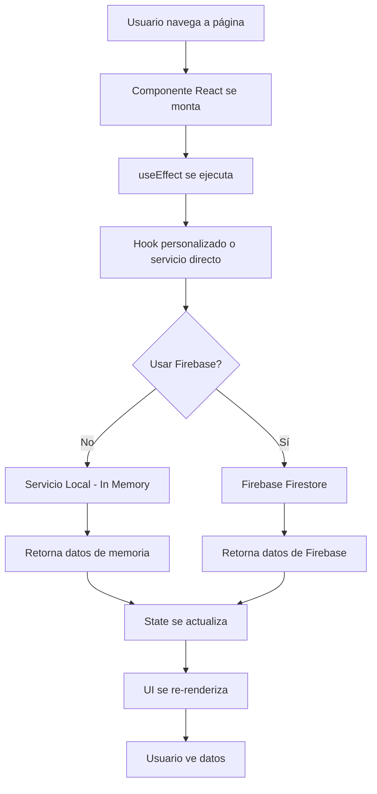
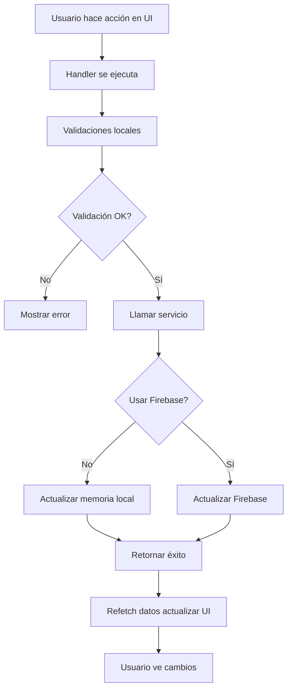

# 📊 Arquitectura de Flujo de Datos - Personal Showcase

> Documentación completa del flujo de datos desde servicios hasta componentes UI, preparada para migración a Firebase.

---

## 📋 Tabla de Contenidos

1. [Arquitectura General](#arquitectura-general)
2. [Servicios Locales (In-Memory)](#servicios-locales-in-memory)
3. [Flujo de Datos por Módulo](#flujo-de-datos-por-módulo)
4. [Componentes y sus Dependencias](#componentes-y-sus-dependencias)
5. [Preparación para Firebase](#preparación-para-firebase)
6. [Diagrama de Flujo](#diagrama-de-flujo)

---

## 🏗️ Arquitectura General

### Capas de la Aplicación

```
┌─────────────────────────────────────────┐
│         UI COMPONENTS (React)           │
│  ┌──────────┐ ┌──────────┐ ┌─────────┐│
│  │  Pages   │ │ Layouts  │ │ Widgets ││
│  └──────────┘ └──────────┘ └─────────┘│
└─────────────┬───────────────────────────┘
              │
┌─────────────▼───────────────────────────┐
│         HOOKS (Custom Hooks)            │
│  ┌──────────────┐  ┌─────────────────┐ │
│  │ useBlogData  │  │ useAuth, etc    │ │
│  └──────────────┘  └─────────────────┘ │
└─────────────┬───────────────────────────┘
              │
┌─────────────▼───────────────────────────┐
│         SERVICES (Data Layer)           │
│  ┌─────────┐ ┌────────┐ ┌────────────┐ │
│  │ postSvc │ │ userSvc│ │ aboutSvc   │ │
│  └─────────┘ └────────┘ └────────────┘ │
└─────────────┬───────────────────────────┘
              │
┌─────────────▼───────────────────────────┐
│      DATA SOURCES (In-Memory)           │
│  ┌─────────────────────────────────────┐│
│  │ Mock Data (posts, users, etc.)     ││
│  │ En memoria (session storage)       ││
│  └─────────────────────────────────────┘│
└─────────────────────────────────────────┘
```

---

## 🗄️ Servicios Locales (In-Memory)

### 1. **postService.ts** 
**Ubicación**: `src/services/postService.ts`

#### Funciones Disponibles:
```typescript
// CRUD Operaciones
getPosts() → BlogPost[]
getPostById(id: string) → BlogPost | null
getPostBySlug(slug: string) → BlogPost | null
createPost(data) → BlogPost
updatePost(id: string, data) → BlogPost
deletePost(id: string) → void

// Filtrado y Búsqueda
getPublishedPosts() → BlogPost[]
getFeaturedPosts() → BlogPost[]
getPostsByCategory(categoryId: string) → BlogPost[]
getPostsByTag(tagId: string) → BlogPost[]
searchPosts(query: string) → BlogPost[]

// Utilidades
generatePostSlug(title: string) → string
calculateReadingTime(content: string) → number
```

#### Componentes que lo consumen:
- `BlogPage.tsx` (público)
- `PostsPage.tsx` (admin)
- `useBlogData.ts` (hook)

---

### 2. **categoryService.ts**
**Ubicación**: `src/services/categoryService.ts`

#### Funciones Disponibles:
```typescript
getCategories() → Category[]
getCategoryById(id: string) → Category | null
getCategoryBySlug(slug: string) → Category | null
createCategory(data) → Category
updateCategory(id: string, data) → Category
deleteCategory(id: string) → void
getCategoryStats() → { id, name, postCount }[]
generateCategorySlug(name: string) → string
getCategoryRandomColor() → string
```

#### Componentes que lo consumen:
- `BlogPage.tsx` (filtros)
- `CategoriesPage.tsx` (admin)
- `PostsPage.tsx` (selector)

---

### 3. **tagService.ts**
**Ubicación**: `src/services/tagService.ts`

#### Funciones Disponibles:
```typescript
getTags() → Tag[]
getTagById(id: string) → Tag | null
getTagBySlug(slug: string) → Tag | null
createTag(data) → Tag
updateTag(id: string, data) → Tag
deleteTag(id: string) → void
getTagRandomColor() → string
generateTagSlug(name: string) → string
```

#### Componentes que lo consumen:
- `BlogPage.tsx` (filtros)
- `TagsPage.tsx` (admin)
- `PostsPage.tsx` (selector múltiple)

---

### 4. **userService.ts**
**Ubicación**: `src/services/userService.ts`

#### Funciones Disponibles:
```typescript
getUsers() → User[]
getUserById(id: string) → User | null
getUserByEmail(email: string) → User | null
getUserByUsername(username: string) → User | null
createUser(data) → User
updateUser(id: string, data) → User
deleteUser(id: string) → void
toggleUserActive(id: string) → User
getUsersStats() → { total, admins, users, guests, verified, active }
```

#### Componentes que lo consumen:
- `UsersPage.tsx` (admin)
- `AuthContext.tsx` (autenticación)
- `AdminLayout.tsx` (info usuario)

---

### 5. **AboutService.ts**
**Ubicación**: `src/services/aboutService.ts`

#### Funciones Disponibles:
```typescript
static getAboutData() → AboutData
static updateAboutData(data: Partial<AboutData>) → AboutData
static resetAboutData() → void
```

#### Componentes que lo consumen:
- `AboutPage.tsx` (público)
- `ProfilePage.tsx` (admin)

---

### 6. **TimelineService.ts**
**Ubicación**: `src/services/timelineService.ts`

#### Funciones Disponibles:
```typescript
static getTimelineData() → TimelineData
static updateTimelineData(data: Partial<TimelineData>) → TimelineData
static resetTimelineData() → void
```

#### Componentes que lo consumen:
- `AboutPage.tsx` (sección timeline)
- `TimelinePage.tsx` (admin)

---

### 7. **contactService.ts**
**Ubicación**: `src/services/contactService.ts`

#### Funciones Disponibles:
```typescript
static sendContactMessage(data: ContactMessage) → Promise<{ success: boolean }>
```

#### Componentes que lo consumen:
- `ContactMePage.tsx` (formulario)

---

## 🔄 Flujo de Datos por Módulo

### 📝 Módulo Blog (Posts)

#### Flujo Completo: Leer Posts

```
┌──────────────────────────────────────────────────────────┐
│ 1. USUARIO NAVEGA A /blog                                │
└────────────────────┬─────────────────────────────────────┘
                     │
┌────────────────────▼─────────────────────────────────────┐
│ 2. BlogPage.tsx se monta                                 │
│    - useEffect(() => loadData(), [])                     │
└────────────────────┬─────────────────────────────────────┘
                     │
┌────────────────────▼─────────────────────────────────────┐
│ 3. useBlogData hook se ejecuta                           │
│    - const { posts, loading } = useBlogData()            │
└────────────────────┬─────────────────────────────────────┘
                     │
┌────────────────────▼─────────────────────────────────────┐
│ 4. postService.getPosts() llamado                        │
│    - Simula delay de 300ms                               │
│    - Retorna datos de postsDB (memoria)                  │
└────────────────────┬─────────────────────────────────────┘
                     │
┌────────────────────▼─────────────────────────────────────┐
│ 5. Hook procesa datos                                    │
│    - Aplica filtros (categoría, tags, búsqueda)         │
│    - Aplica paginación                                   │
│    - Calcula estadísticas                                │
└────────────────────┬─────────────────────────────────────┘
                     │
┌────────────────────▼─────────────────────────────────────┐
│ 6. BlogPage recibe posts procesados                      │
│    - State se actualiza: setPosts(data)                  │
│    - Loading cambia a false                              │
└────────────────────┬─────────────────────────────────────┘
                     │
┌────────────────────▼─────────────────────────────────────┐
│ 7. UI se renderiza                                       │
│    - posts.map(post => <BlogCard {...post} />)          │
│    - BlogCard muestra: título, excerpt, stats, etc      │
└──────────────────────────────────────────────────────────┘
```

#### Flujo Completo: Crear Post (Admin)

```
┌──────────────────────────────────────────────────────────┐
│ 1. ADMIN CLICK "Nuevo Post" en /admin/posts             │
└────────────────────┬─────────────────────────────────────┘
                     │
┌────────────────────▼─────────────────────────────────────┐
│ 2. Dialog se abre                                        │
│    - Formulario vacío se muestra                         │
│    - formData state inicializado                         │
└────────────────────┬─────────────────────────────────────┘
                     │
┌────────────────────▼─────────────────────────────────────┐
│ 3. ADMIN completa formulario                             │
│    - onChange actualiza formData state                   │
│    - Validaciones en tiempo real                         │
└────────────────────┬─────────────────────────────────────┘
                     │
┌────────────────────▼─────────────────────────────────────┐
│ 4. ADMIN CLICK "Crear Post"                             │
│    - handleCreate() se ejecuta                           │
└────────────────────┬─────────────────────────────────────┘
                     │
┌────────────────────▼─────────────────────────────────────┐
│ 5. postService.createPost(formData) llamado              │
│    - Genera ID único                                     │
│    - Genera slug automático                              │
│    - Calcula readingTime                                 │
│    - Agrega a postsDB (memoria)                          │
│    - Simula delay 300ms                                  │
└────────────────────┬─────────────────────────────────────┘
                     │
┌────────────────────▼─────────────────────────────────────┐
│ 6. Respuesta exitosa                                     │
│    - Dialog se cierra                                    │
│    - loadData() se llama (refetch)                       │
└────────────────────┬─────────────────────────────────────┘
                     │
┌────────────────────▼─────────────────────────────────────┐
│ 7. Tabla se actualiza                                    │
│    - Nuevo post aparece en la lista                      │
│    - Estadísticas se recalculan                          │
└──────────────────────────────────────────────────────────┘
```

---

### 👥 Módulo Usuarios

#### Flujo: Gestión de Usuarios

```
/admin/users (UsersPage.tsx)
    │
    ├─ useEffect → loadData()
    │   └─ userService.getUsers()
    │   └─ userService.getUsersStats()
    │
    ├─ Crear Usuario
    │   └─ handleCreate()
    │       └─ userService.createUser(formData)
    │           ├─ Valida email único
    │           ├─ Valida username único
    │           └─ Agrega a usersDB
    │
    ├─ Editar Usuario
    │   └─ handleEdit()
    │       └─ userService.updateUser(id, formData)
    │
    ├─ Activar/Desactivar
    │   └─ handleToggleActive()
    │       └─ userService.toggleUserActive(id)
    │
    └─ Eliminar Usuario
        └─ handleDelete()
            └─ userService.deleteUser(id)
```

---

### 📄 Módulo About/Profile

#### Flujo: Secciones About

```
/admin/profile (ProfilePage.tsx)
    │
    ├─ useEffect → loadData()
    │   └─ AboutService.getAboutData()
    │       └─ Retorna { sections: AboutSection[] }
    │
    ├─ Crear Sección
    │   └─ handleCreate()
    │       └─ AboutService.updateAboutData({ sections: [...sections, newSection] })
    │
    ├─ Editar Sección
    │   └─ handleEdit()
    │       └─ AboutService.updateAboutData({ sections: updatedSections })
    │
    └─ Eliminar Sección
        └─ handleDelete()
            └─ AboutService.updateAboutData({ sections: filteredSections })

/about (AboutPage.tsx) - Público
    │
    └─ useEffect → loadData()
        └─ AboutService.getAboutData()
            └─ Muestra sections.map(section => renderSection)
```

---

### ⏱️ Módulo Timeline

#### Flujo: Items Timeline

```
/admin/timeline (TimelinePage.tsx)
    │
    ├─ useEffect → loadData()
    │   └─ TimelineService.getTimelineData()
    │       └─ Retorna { items: TimelineItem[] }
    │
    ├─ Estadísticas
    │   └─ items.filter(i => i.type === 'work').length
    │   └─ items.filter(i => i.type === 'education').length
    │   └─ items.filter(i => i.type === 'certification').length
    │   └─ items.filter(i => i.type === 'project').length
    │
    ├─ Crear Item
    │   └─ handleCreate()
    │       └─ TimelineService.updateTimelineData({ items: [...items, newItem] })
    │
    └─ Editar/Eliminar
        └─ Similar a About sections
```

---

## 🎨 Componentes y sus Dependencias

### Componentes Públicos (Frontend)

| Componente | Ruta | Servicios Usados | Hooks Usados |
|------------|------|------------------|--------------|
| `HomePage.tsx` | `/` | - | - |
| `BlogPage.tsx` | `/blog` | `postService`, `categoryService`, `tagService` | `useBlogData` |
| `AboutPage.tsx` | `/about` | `AboutService`, `TimelineService` | - |
| `ContactMePage.tsx` | `/contactame` | `contactService` | - |

### Componentes Admin (Panel)

| Componente | Ruta | Servicios Usados | Operaciones |
|------------|------|------------------|-------------|
| `AdminPage.tsx` | `/admin` | Todos (stats) | Read |
| `PostsPage.tsx` | `/admin/posts` | `postService`, `categoryService`, `tagService` | CRUD completo |
| `CategoriesPage.tsx` | `/admin/categories` | `categoryService`, `postService` (stats) | CRUD completo |
| `TagsPage.tsx` | `/admin/tags` | `tagService`, `postService` (stats) | CRUD completo |
| `UsersPage.tsx` | `/admin/users` | `userService` | CRUD completo |
| `ProfilePage.tsx` | `/admin/profile` | `AboutService` | CRUD sections |
| `TimelinePage.tsx` | `/admin/timeline` | `TimelineService` | CRUD items |

---

## 🔥 Preparación para Firebase

### Estructura de Firebase (Propuesta)

```
firestore/
├── posts/
│   └── {postId}
│       ├── id
│       ├── title
│       ├── slug
│       ├── content
│       ├── authorId → users/{userId}
│       ├── categoryId → categories/{categoryId}
│       ├── tagIds[] → tags/{tagId}
│       ├── isPublished
│       ├── createdAt
│       └── stats { views, likes, comments }
│
├── categories/
│   └── {categoryId}
│       ├── id
│       ├── name
│       ├── slug
│       ├── color
│       └── icon
│
├── tags/
│   └── {tagId}
│       ├── id
│       ├── name
│       ├── slug
│       └── color
│
├── users/
│   └── {userId}
│       ├── id
│       ├── email
│       ├── displayName
│       ├── role
│       └── ...
│
├── about/
│   └── main (documento único)
│       └── sections[]
│
└── timeline/
    └── main (documento único)
        └── items[]
```

### Migración: Servicio Local → Firebase

#### Ejemplo: postService.ts

**ANTES (Local)**:
```typescript
export async function getPosts(): Promise<BlogPost[]> {
  await delay();
  return [...postsDB];
}
```

**DESPUÉS (Firebase)**:
```typescript
export async function getPosts(): Promise<BlogPost[]> {
  const postsRef = collection(db, 'posts');
  const q = query(postsRef, orderBy('createdAt', 'desc'));
  const snapshot = await getDocs(q);
  
  return snapshot.docs.map(doc => ({
    id: doc.id,
    ...doc.data()
  } as BlogPost));
}
```

### Pasos para Migración a Firebase

#### 1. **Instalar Firebase**
```bash
npm install firebase
```

#### 2. **Configurar Firebase**
```typescript
// src/config/firebase.ts
import { initializeApp } from 'firebase/app';
import { getFirestore } from 'firebase/firestore';
import { getAuth } from 'firebase/auth';

const firebaseConfig = {
  apiKey: process.env.VITE_FIREBASE_API_KEY,
  authDomain: process.env.VITE_FIREBASE_AUTH_DOMAIN,
  projectId: process.env.VITE_FIREBASE_PROJECT_ID,
  // ...
};

const app = initializeApp(firebaseConfig);
export const db = getFirestore(app);
export const auth = getAuth(app);
```

#### 3. **Actualizar Servicios (uno por uno)**

**Orden sugerido de migración**:
1. ✅ `userService.ts` (autenticación primero)
2. ✅ `categoryService.ts` (dependencia de posts)
3. ✅ `tagService.ts` (dependencia de posts)
4. ✅ `postService.ts` (con referencias)
5. ✅ `AboutService.ts` (simple)
6. ✅ `TimelineService.ts` (simple)
7. ✅ `contactService.ts` (último)

#### 4. **Mantener Compatibilidad**

Usar un patrón adaptador para transición suave:

```typescript
// src/services/postService.ts

const USE_FIREBASE = import.meta.env.VITE_USE_FIREBASE === 'true';

export async function getPosts(): Promise<BlogPost[]> {
  if (USE_FIREBASE) {
    return getPostsFromFirebase();
  }
  return getPostsLocal();
}

async function getPostsLocal(): Promise<BlogPost[]> {
  // Implementación actual
}

async function getPostsFromFirebase(): Promise<BlogPost[]> {
  // Nueva implementación Firebase
}
```

---

## 📊 Diagrama de Flujo Completo

### Flujo de Lectura (GET)



### Flujo de Escritura (CREATE/UPDATE/DELETE)



---

## 🔍 Mapeo Rápido: Funcionalidad → Archivos

### Blog System
```
Funcionalidad: Ver posts públicos
├─ Componente: src/pages/blog/BlogPage.tsx
├─ Hook: src/hooks/useBlogData.ts
├─ Servicio: src/services/postService.ts
└─ Data: src/data/posts.data.ts

Funcionalidad: Gestionar posts (admin)
├─ Componente: src/admin/pages/PostsPage.tsx
├─ Servicio: src/services/postService.ts
└─ Data: src/data/posts.data.ts
```

### Categories & Tags
```
Funcionalidad: Gestionar categorías
├─ Componente: src/admin/pages/CategoriesPage.tsx
├─ Servicio: src/services/categoryService.ts
└─ Data: src/data/categories.data.ts

Funcionalidad: Gestionar tags
├─ Componente: src/admin/pages/TagsPage.tsx
├─ Servicio: src/services/tagService.ts
└─ Data: src/data/tags.data.ts
```

### Users
```
Funcionalidad: Gestionar usuarios
├─ Componente: src/admin/pages/UsersPage.tsx
├─ Servicio: src/services/userService.ts
└─ Data: src/data/users.data.ts
```

### About & Timeline
```
Funcionalidad: Ver About (público)
├─ Componente: src/pages/about/AboutPage.tsx
├─ Servicio: src/services/aboutService.ts
└─ Data: src/data/about.data.ts

Funcionalidad: Gestionar About (admin)
├─ Componente: src/admin/pages/ProfilePage.tsx
├─ Servicio: src/services/aboutService.ts
└─ Data: src/data/about.data.ts

Funcionalidad: Gestionar Timeline (admin)
├─ Componente: src/admin/pages/TimelinePage.tsx
├─ Servicio: src/services/timelineService.ts
└─ Data: src/data/timeline.data.ts
```

---

## 📝 Notas Importantes

### Estado Actual (In-Memory)
- ✅ Todos los datos se almacenan en memoria (session)
- ✅ Cambios se pierden al recargar la página
- ✅ Simulación de delays de red (300ms)
- ✅ Console logs para debugging
- ✅ Funciones de reset disponibles

### Ventajas del Diseño Actual
- ✅ **Desarrollo rápido**: Sin configuración de backend
- ✅ **Testing fácil**: Datos predecibles
- ✅ **Migración simple**: Capa de servicios bien definida
- ✅ **Type-safe**: TypeScript en todas las capas

### Próximos Pasos para Firebase
1. Crear proyecto en Firebase Console
2. Configurar variables de entorno
3. Migrar servicios uno por uno
4. Implementar Firebase Authentication
5. Configurar reglas de seguridad
6. Crear índices compuestos
7. Testing exhaustivo
8. Deploy a producción

---

## 🎯 Resumen Ejecutivo

### Arquitectura Actual
- **7 Servicios** locales en memoria
- **13 Componentes** principales
- **4 Hooks** personalizados
- **100% TypeScript** type-safe
- **Listo para Firebase** con migración incremental

### Puntos de Integración Firebase
- Todos los servicios tienen interfaces bien definidas
- Estado manejado con hooks de React
- Validaciones en capa de servicios
- Errores manejados consistentemente
- UI desacoplada de la lógica de datos

---

**Última actualización**: 10 de octubre de 2025  
**Versión**: 1.0  
**Estado**: ✅ Documentación completa - Lista para migración a Firebase
